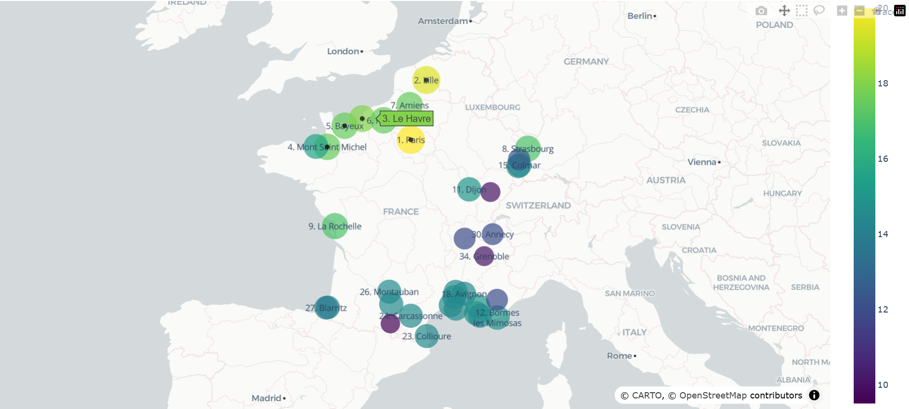
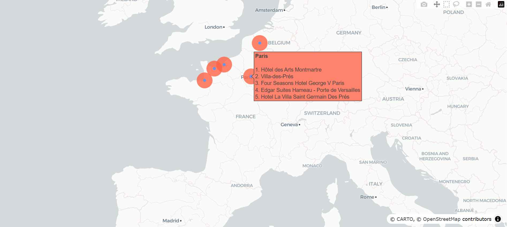

# Plan your trip with Kayak 🌤️✈️

A data engineering project that recommends the best travel destinations in France based on weather forecasts and hotel availability.

## 📋 Project Overview

This project implements an automated data pipeline that helps Kayak users plan their trips by:
- Analyzing weather forecasts for the next 7 days across 35 French cities
- Identifying the top 5 destinations with the best weather conditions
- Scraping hotel information from Booking.com for these destinations
- Storing and processing data
- Generating interactive maps to visualize recommendations

## 🏗️ Architecture

**Tech Stack:**
- **Languages**: Python 3.x
- **Data Collection**: OpenWeatherMap API, Nominatim API, Web Scraping (BeautifulSoup)
- **Data Processing**: Pandas, NumPy
- **Cloud Storage**: AWS S3 (Data Lake)
- **Database**: MySQL on AWS RDS (Data Warehouse)
- **Visualization**: Plotly (Interactive maps)
- **Orchestration**: Jupyter Notebooks + Python scripts

## 📁 Project Structure

```
├── city_data/
│   ├── df_city.csv
│   ├── df_city_light.csv
│   └── df_top_5_city.csv
├── hotel_data/
│   ├── booking_hotels.csv
│   └── booking_hotels_meteo.csv
├── html_data/
│   └── booking_*.html           # Raw HTML pages from Booking.com (5 files: one per city)
├── maps/
│   ├── carte_villes_interactive.html
│   └── carte_hotels_interactive.html
├── notebooks/
│   ├── analyze_meteo_city.ipynb
│   ├── scrape_booking.ipynb
│   └── get_map.ipynb
├── script/
│   └── export_data.py
└── requirements/
    └── requirements.txt
```

## 🚀 Getting Started

### Prerequisites

- Python 3.x
- AWS Account with S3 and RDS access
- OpenWeatherMap API key (free tier)

### Installation

1. Clone the repository
```bash
git clone https://github.com/JulienRouillard/kayak-trip-planner.git
cd kayak-trip-planner
```

2. Install dependencies
```bash
pip install -r requirements/requirements.txt
```

3. Configure environment variables

Create a `.env` file or set the following variables:
```bash
# OpenWeatherMap API
OPENWEATHER_API_KEY=your_api_key

# AWS Configuration
AWS_ACCESS_KEY_ID=your_access_key
AWS_SECRET_ACCESS_KEY=your_secret_key
AWS_REGION_NAME=your_region
S3_BUCKET_NAME=your_bucket_name

# MySQL Database
DB_HOST=your_rds_endpoint
DB_USER=your_username
DB_PASSWORD=your_password
DB_NAME=your_database_name
```

## 📊 Usage

Execute the pipeline in the following order:

### 1. Weather Data Collection and Analysis
```bash
jupyter notebook notebooks/analyze_meteo_city.ipynb
```
- Fetches GPS coordinates for 35 French cities using Nominatim API
- Collects 7-day weather forecasts from OpenWeatherMap
- Identifies top 5 cities with optimal weather conditions
- Outputs: `df_city.csv`, `df_top_5_city.csv`, `df_city_light.csv`

### 2. Hotel Data Scraping
```bash
jupyter notebook notebooks/scrape_booking.ipynb
```
- Scrapes Booking.com for hotel information in top 5 cities
- Extracts: hotel name, URL, rating, description
- Collects 5 hotels per city (25 hotels total)
- Outputs: `booking_hotels.csv`, `booking_hotels_meteo.csv`

### 3. Map Generation
```bash
jupyter notebook notebooks/get_map.ipynb
```
- Creates interactive Plotly maps
- Outputs: `carte_villes_interactive.html`, `carte_hotels_interactive.html`

### 4. ETL Process
```bash
python script/export_data.py
```
- Uploads all CSV files to AWS S3 (Data Lake)
- Extracts data from S3
- Loads data into MySQL database (Data Warehouse)

## 🗺️ Results

The project generates two interactive maps:

### Top 5 Weather Destinations
Interactive map showing the French cities with the best weather forecast for the next 7 days.



**Note**: Get the html code with interactive version at maps/carte_villes_interactive.html

### Recommended Hotels
Interactive map displaying the top-rated hotels in each recommended destination.



**Note**: Get the html code with interactive version at maps/carte_hotels_interactive.html

## 🤝 Contact

Feel free to reach me at julien.rouillard@yahoo.fr

---

*Built with Python*